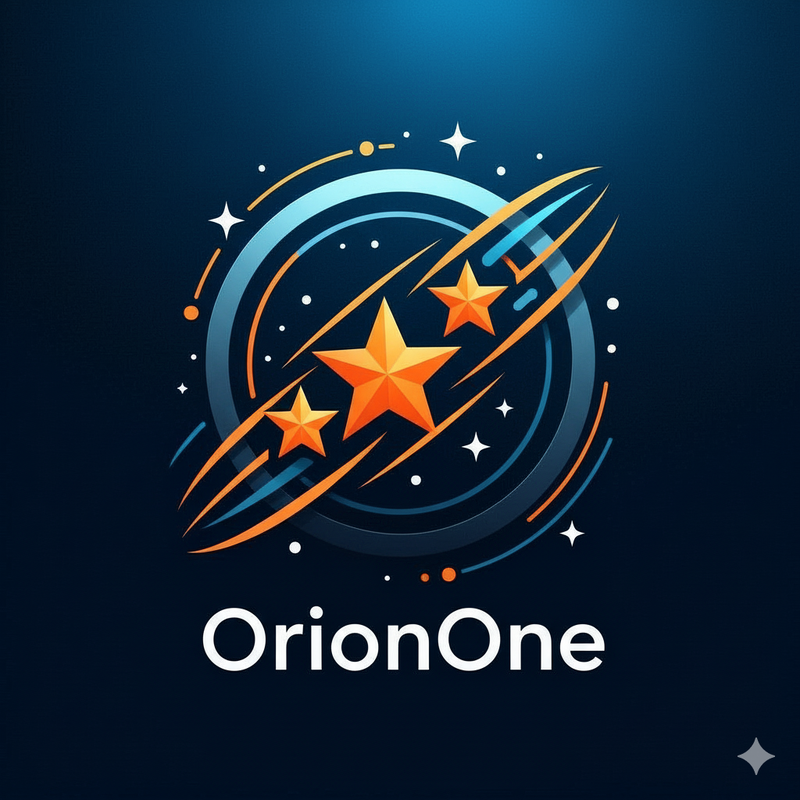

<div align="center">
  

# OrionOne

**Modern IT Service Management Platform**

[](https://www.php.net/)
[](https://laravel.com)
[](https://vuejs.org/)
[](https://inertiajs.com/)
[](https://www.postgresql.org/)
[](https://www.docker.com/)
[](LICENSE)

</div>

> Uma plataforma completa de gestão de tickets de suporte técnico, desenvolvida com Laravel 11 e Vue 3, focada em simplicidade, performance e experiência do utilizador.

## Sobre o Projeto

OrionOne é um sistema ITSM (IT Service Management) desenvolvido como projeto final do CET - Técnico especialista em tecnologias e programação de sistemas de informação. inspirado em soluções enterprise como ServiceNow e Jira Service Desk, o OrionOne oferece uma alternativa moderna, ágil e intuitiva para gestão de suporte técnico.

### Principais Características

**Gestão de Tickets**

-   Sistema completo de criação, atribuição e acompanhamento de tickets
-   Estados configuráveis (Open, In Progress, Resolved, Closed)
-   Priorização automática e manual
-   SLA tracking com alertas de violação

**Equipas & Colaboração**

-   Organização por equipas especializadas
-   Sistema de comentários públicos e internos
-   Atribuição automática baseada em regras
-   Notificações por email em tempo real

**Knowledge Base**

-   Base de conhecimento para self-service
-   Sistema de categorias e pesquisa
-   Métricas de utilidade dos artigos
-   Interface de criação simples para agents

**Dashboard & Métricas**

-   Visão geral de tickets por estado
-   Análise de performance de SLA
-   Estatísticas por equipa e agent
-   Tracking de tendências

---

## Stack Tecnológica

### Backend

-   **Laravel 12** - Framework PHP moderno
-   **PostgreSQL 16** - Base de dados relacional
-   **Redis 7** - Cache e queue management
-   **Spatie Laravel Data** - DTOs type-safe + validação
-   **Laravel Actions** - Lógica reutilizável (Controller/Job/Command)
-   **Query Builder** - Filtros automáticos via URL

### Frontend

-   **Vue 3** - Progressive JavaScript framework
-   **Inertia.js** - Monolith SPA approach
-   **Tailwind CSS** - Utility-first CSS framework
-   **Shadcn-vue** - Componentes UI (Radix + Tailwind)
-   **Vite 7** - Next generation frontend tooling

### Packages Principais

```
# Arquitetura Moderna
spatie/laravel-data              # DTOs + Validação automática
lorisleiva/laravel-actions       # Actions reutilizáveis
spatie/laravel-query-builder     # Filtros URL

# Segurança & Audit
spatie/laravel-permission        # RBAC (Roles & Permissions)
spatie/laravel-activitylog       # Audit trail
laravel/sanctum                  # API authentication

# Developer Experience
barryvdh/laravel-ide-helper      # Autocomplete IDE
laravel/telescope                # Debug & monitoring
```

**[Stack Completo →](docs/tech-stack.md)**

---

## Requisitos

-   PHP 8.2 ou superior
-   Composer 2.x
-   Node.js 20 LTS
-   PostgreSQL 16
-   Redis 7.x

---

## Instalação

### 1. Clonar o Repositório

```bash
git clone https://github.com/JMSS95/OrionOne.git
cd OrionOne
```

### 2. Backend Setup

```bash
# Instalar dependências
composer install

# Configurar ambiente
cp .env.example .env
php artisan key:generate

# Configurar base de dados no .env
# DB_CONNECTION=pgsql
# DB_DATABASE=orionone
# DB_USERNAME=laravel
# DB_PASSWORD=secret

# Executar migrations
php artisan migrate

# Popular com dados de teste
php artisan db:seed
```

### 3. Frontend Setup

```bash
# Instalar dependências
npm install

# Build para desenvolvimento
npm run dev
```

### 4. Iniciar Aplicação

```bash
# Terminal 1: Laravel
php artisan serve

# Terminal 2: Vite
npm run dev

# Aceder em: http://orionone.test:8888/
```

---

## Docker Setup (Alternativa)

```bash
# Iniciar containers
docker-compose up -d

# Setup inicial
docker-compose exec app composer install
docker-compose exec app cp .env.example .env
docker-compose exec app php artisan key:generate
docker-compose exec app php artisan migrate --seed

# Aceder em: http://orionone.test:8888/
```

---

## Utilizadores de Teste

Após executar `php artisan db:seed`:

| Role  | Email               | Password |
| ----- | ------------------- | -------- |
| Admin | admin@orionone.test | password |
| Agent | john@orionone.test  | password |
| Agent | jane@orionone.test  | password |
| User  | user1@orionone.test | password |

---

## Arquitetura

OrionOne segue uma arquitetura **MVC com Service Layer + Actions**, equilibrando simplicidade com boas práticas de Engenharia de Software:

```
Controllers (thin) → Services (business logic) → Models (data)
 ↓
 Actions (atomic operations)
```

**Camadas principais:**

-   **Presentation:** Controllers, Requests, Views (Inertia/Vue)
-   **Business Logic:** Services, Actions, Policies
-   **Data:** Models, Observers, Migrations
-   **Infrastructure:** PostgreSQL, Redis, Queue Jobs

    **Documentação completa:** [docs/architecture.md](docs/architecture.md)

---

## Documentação

### Essencial (Ler Primeiro)

-   **[Tech Stack](docs/tech-stack.md)** - Todas as tecnologias instaladas
-   **[Implementation Checklist](docs/implementation-checklist.md)** - Guia passo a passo com código
-   **[Development Planning](docs/development-planning.md)** - Sprints e roadmap

### Arquitetura & Design

-   **[Architecture](docs/architecture.md)** - Arquitetura MVC + Services + Actions
-   **[Database Schema](docs/database-schema.md)** - Schema completo com relacionamentos
-   **[Requirements](docs/requirements.md)** - Requisitos funcionais e não-funcionais

### Desenvolvimento

-   **[Development Guide](docs/development-guide.md)** - Workflow TDD e metodologia
-   **[Business Model](docs/business-model.md)** - Modelo de negócio e SWOT

---

## Database Schema

PostgreSQL 16 com 15+ tabelas otimizadas:

-   **Core:** users, teams, tickets, comments
-   **Knowledge Base:** categories, articles
-   **Permissions:** roles, permissions (Spatie)
-   **Auditoria:** activity_log, soft deletes

    **Schema completo:** [docs/database-schema.md](docs/database-schema.md)

---

## Estrutura do Projeto

```
OrionOne/
 app/
 Http/ # Controllers, Requests, Middleware
 Services/ # Business logic (TicketService, SLAService, etc)
 Actions/ # Atomic operations (CreateTicketAction, etc)
 Models/ # Eloquent models
 Policies/ # Authorization
 Observers/ # Model hooks
 Notifications/ # Email, Slack, Database
 Events/ # Domain events
 Listeners/ # Event handlers
 Jobs/ # Async tasks

 database/
 migrations/ # Schema definitions
 seeders/ # Test data
 factories/ # Model factories

 resources/
 js/
 Pages/ # Inertia.js pages (Vue 3)
 Components/ # Reusable Vue components
 Composables/ # Vue composables
 Utils/ # Helper functions
 css/
 app.css # Tailwind CSS

 tests/
 Feature/ # HTTP tests
 Unit/ # Logic tests

 docs/ # Technical documentation
```

---

## Metodologia de Desenvolvimento

Este projeto segue **boas práticas profissionais** de desenvolvimento:

### Feature-Driven Development + TDD

-   **Desenvolvimento iterativo**: Uma feature completa de cada vez (não todas as camadas de uma vez)
-   **Test-Driven Development**: Testes escritos **antes** do código (RED → GREEN → REFACTOR)
-   **Qualidade contínua**: PHPStan level 5, Laravel Pint, >80% code coverage

### 6-Phase Workflow por Feature

1. **Planning** (30min) - User stories e critérios de aceitação
2. **Database** (45min) - Migration, Model, Factory, Seeder
3. **Backend TDD** (2-3h) - Tests primeiro, depois implementação
4. **Frontend** (1-2h) - Componentes Vue 3 + Inertia.js
5. **API** (1h) - Endpoints opcionais se necessário
6. **Commit** (15min) - Git commit com mensagem descritiva

**Documentação completa**: Ver [`docs/development-workflow.md`](docs/development-workflow.md)

### Scripts de Automação

```powershell
# Scaffold completo de uma feature (migration, model, controller, tests, etc)
.\scripts\feature.ps1 Ticket
```

---

## Funcionalidades Planeadas

### MVP (Fase 1) - 2.5 meses

-   [ ] Autenticação e autorização multi-role
-   [ ] CRUD completo de tickets
-   [ ] Sistema de comentários (públicos e internos)
-   [ ] Gestão de equipas
-   [ ] Atribuição automática de tickets
-   [ ] SLA tracking básico
-   [ ] Knowledge base com pesquisa
-   [ ] Dashboard com métricas
-   [ ] Notificações por email
-   [ ] Activity log (auditoria)

### Fase 2 (Futuro)

-   [ ] Real-time updates via WebSockets
-   [ ] Anexos de ficheiros
-   [ ] Relatórios avançados (PDF/Excel)
-   [ ] Full-text search (PostgreSQL)
-   [ ] API RESTful

### Roadmap (Longo Prazo)

-   [ ] Multi-tenancy
-   [ ] Workflows configuráveis
-   [ ] Integração com email (IMAP)
-   [ ] Mobile app
-   [ ] Sistema de aprovações

---

## Testes

```bash
# Executar suite de testes
php artisan test

# Com cobertura
php artisan test --coverage

# Testes específicos
php artisan test --filter TicketTest
```

**Estratégia de testes:**

-   **Unit Tests:** Services, Actions (mock dependencies)
-   **Feature Tests:** HTTP requests completos
-   **Browser Tests:** Dusk (opcional, fluxos críticos)

---

## Deployment

### Produção

```bash
# Build assets
npm run build

# Optimize Laravel
php artisan config:cache
php artisan route:cache
php artisan view:cache

# Migrations em produção
php artisan migrate --force
```

### Ambiente Recomendado

-   PHP 8.2 FPM
-   Nginx
-   PostgreSQL 16
-   Redis
-   Supervisor (para queues)

---

## Segurança

-   Autenticação via Laravel Sanctum
-   CSRF protection em todos os forms
-   Password hashing com Bcrypt
-   SQL injection protection via Eloquent
-   XSS protection automático
-   Rate limiting por IP
-   Autorização granular via Policies

---

## Contribuir

```bash
# Fork o repositório
git checkout -b feature/nova-funcionalidade
git commit -m "feat: adiciona funcionalidade X"
git push origin feature/nova-funcionalidade
# Abrir Pull Request
```

### Convenções

**Commits**: Conventional Commits

```
feat: nova funcionalidade
fix: correção de bug
docs: documentação
refactor: refatoração
test: testes
```

**Code Style**: PSR-12 (PHP), ESLint (JavaScript)

---

## Documentação

### Documentação do Projeto

-   [Requisitos Funcionais e Não-Funcionais](docs/requirements.md)
-   [Arquitetura da Aplicação](docs/architecture.md)
-   [Schema da Base de Dados](docs/database-schema.md)
-   [Guia de Desenvolvimento](docs/development-guide.md)
-   [Planeamento de Desenvolvimento](docs/development-planning.md) ⭐
-   [Modelo de Negócio](docs/business-model.md) ⭐
-   [Tech Stack Completo](docs/tech-stack.md) ⭐ **NOVO**

### Guias de Setup

-   [Setup Completo](SETUP.md)
-   [Como Contribuir](CONTRIBUTING.md)

---

## Licença

Projeto académico desenvolvido para o CET - Técnico especialista em tecnologias e programação de sistemas de informação.

**Instituição**: Centro de Formação Profissional de Évora
**Ano Letivo**: 2024/2026

---

## Autor

**João Santos**
[Email](JMSS1995@hotmail.com) • [GitHub](https://github.com/JMSS95)

---

## Agradecimentos

Desenvolvido com Laravel, Vue.js, e

Stack construída sobre os ombros de gigantes:

-   Laravel Framework
-   Vue.js Team
-   Spatie packages
-   Tailwind Labs
-   Open Source Community

---

**OrionOne** • Modern ITSM Platform • 2025
